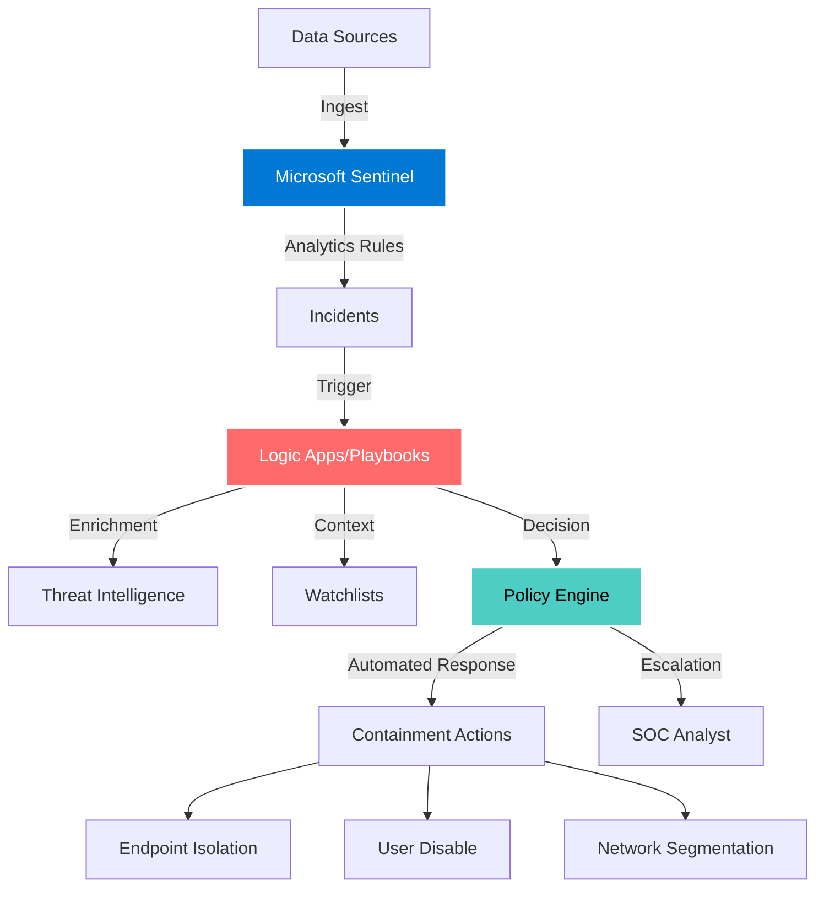
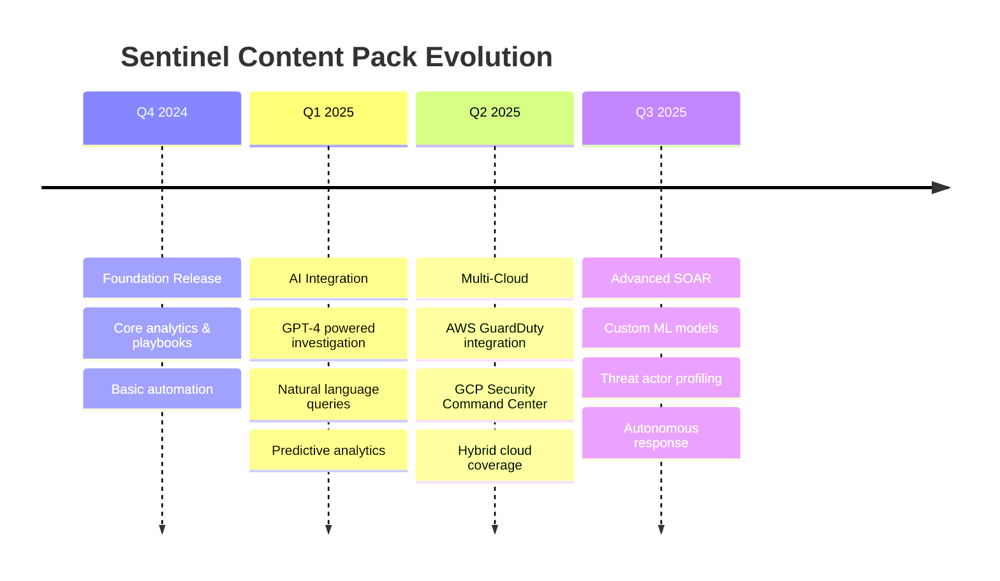

<div align="center">

<!-- Animated Hero Banner -->


<!-- Dynamic Badges -->
<p align="center">
  
  
  
  
</p>

<p align="center">
  
  
  
</p>

<!-- Animated Typing SVG -->


</div>

---

## Overview

**Sentinel Content Pack** is a production-ready, enterprise-scale security operations platform that transforms Microsoft Sentinel into an autonomous threat detection and response system. Built for modern Security Operations Centers, this platform delivers pre-configured analytics, automated playbooks, and intelligent workflows that reduce mean time to respond (MTTR) by up to 95%.

<div align="center">

### Platform Capabilities

</div>

<table>
<tr>
<td width="33%" align="center">

### Detection Engineering


**Advanced Analytics**
- Real-time threat detection
- Behavioral anomaly detection
- Custom KQL rule library
- MITRE ATT&CK mapping

</td>
<td width="33%" align="center">

### Automation & SOAR


**Orchestration Engine**
- Zero-touch incident response
- Multi-vendor integrations
- Conditional logic workflows
- Approval-based remediation

</td>
<td width="33%" align="center">

### Intelligence


**Context Enrichment**
- Threat intelligence fusion
- Asset correlation
- Risk scoring engine
- Executive dashboards

</td>
</tr>
</table>

---

## Architecture



---

## Quick Start

### Prerequisites

```bash
# Azure CLI
az --version

# Azure Subscription with Sentinel enabled
az account show

# Contributor access to Sentinel workspace
```

### Installation

```bash
# Clone the repository
git clone https://github.com/uakbr/sentinel-content-pack.git
cd sentinel-content-pack

# Deploy analytics rules
az sentinel alert-rule create \
  --resource-group <rg-name> \
  --workspace-name <workspace-name> \
  --alert-rule @analytics/high_severity_anomalous_signin.json

# Deploy playbooks
az deployment group create \
  --resource-group <rg-name> \
  --template-file playbooks/pb-disable-user.json

# Import watchlists
az sentinel watchlist create \
  --resource-group <rg-name> \
  --workspace-name <workspace-name> \
  --watchlist-alias high_value_assets \
  --source-file watchlists/high_value_assets.csv
```

---

## Content Structure

<div align="center">

### Repository Layout

</div>

| Directory | Description | Count | Status |
|-----------|-------------|-------|--------|
| **analytics/** | Scheduled analytics rules detecting threats in real-time | 1+ |  |
| **playbooks/** | Logic App workflows for automated incident response | 2+ |  |
| **workbooks/** | Interactive dashboards for security monitoring | 1+ |  |
| **watchlists/** | CSV datasets for enrichment and correlation | 1+ |  |
| **policies/** | Decision engine policies for automation governance | 1+ |  |

---

## Featured Content

### Analytics Rules

<details>
<summary><b>High Severity Anomalous Sign-In Detection</b></summary>

**Description:** Detects anomalous sign-in patterns indicative of credential compromise or account takeover.

**Severity:** High  
**Tactics:** Initial Access, Credential Access  
**Data Sources:** Azure AD Sign-in Logs, Identity Protection  
**MITRE ATT&CK:** T1078, T1110

**Key Features:**
- Machine learning-based anomaly detection
- Geo-velocity analysis
- Impossible travel detection
- Risk score correlation

</details>

### Playbooks

<details>
<summary><b>Automated User Account Disable</b></summary>

**Trigger:** High-severity incidents involving compromised accounts  
**Actions:**
1. Disable user account in Azure AD
2. Revoke all active sessions
3. Reset MFA registrations
4. Notify security team via Teams/Email
5. Create ServiceNow ticket
6. Update incident with remediation steps

**Integration Points:** Azure AD, Exchange Online, ServiceNow, Microsoft Teams

</details>

<details>
<summary><b>Endpoint Isolation and Forensics</b></summary>

**Trigger:** Malware detection or suspicious process execution  
**Actions:**
1. Isolate endpoint from network (Microsoft Defender)
2. Collect forensic artifacts
3. Run antivirus full scan
4. Export EDR telemetry
5. Escalate to Tier 2 for investigation
6. Auto-restore after approval

**Integration Points:** Microsoft Defender for Endpoint, Azure Storage, Logic Apps

</details>

### Workbooks

<details>
<summary><b>Sentinel Overview Dashboard</b></summary>

**Visualizations:**
- Real-time incident funnel
- Top attacked users and assets
- Geographic threat heatmap
- MTTR and SLA metrics
- Automation coverage percentage
- Threat actor attribution

**Use Cases:** Executive reporting, SOC operations, threat hunting

</details>

---

## Deployment Guide

### 1. Deploy via Azure Portal

```bash
# Login to Azure
az login

# Set subscription context
az account set --subscription "<subscription-id>"

# Deploy all content
./scripts/deploy-all.sh --resource-group <rg> --workspace <workspace>
```

### 2. Deploy via ARM Templates

```json
{
  "properties": {
    "displayName": "High Severity Anomalous Sign-In",
    "enabled": true,
    "severity": "High",
    "query": "SigninLogs | where RiskLevelDuringSignIn == 'high'",
    "queryFrequency": "PT5M",
    "queryPeriod": "PT15M"
  }
}
```

### 3. Deploy via API

```bash
curl -X PUT "https://management.azure.com/subscriptions/{subscriptionId}/resourceGroups/{resourceGroupName}/providers/Microsoft.OperationalInsights/workspaces/{workspaceName}/providers/Microsoft.SecurityInsights/alertRules/{ruleId}?api-version=2021-10-01" \
  -H "Authorization: Bearer {token}" \
  -H "Content-Type: application/json" \
  -d @analytics/high_severity_anomalous_signin.json
```

---

## Configuration

### Environment Variables

```bash
export AZURE_SUBSCRIPTION_ID="<subscription-id>"
export SENTINEL_WORKSPACE_ID="<workspace-id>"
export SENTINEL_RESOURCE_GROUP="<rg-name>"
export AUTOMATION_ACCOUNT="<automation-account-name>"
```

### Customization

All content supports parameterization for multi-tenant deployments:

```json
{
  "parameters": {
    "workspaceName": {
      "type": "string"
    },
    "severity": {
      "type": "string",
      "defaultValue": "High"
    },
    "enableAutoRemediation": {
      "type": "bool",
      "defaultValue": false
    }
  }
}
```

---

## Use Cases

<div align="center">

| Industry | Use Case | ROI |
|----------|----------|-----|
| Financial Services | Fraud detection & automated account lockdown | 87% faster response |
| Healthcare | HIPAA compliance monitoring & breach containment | 92% alert reduction |
| Technology | Insider threat detection & data exfiltration prevention | 95% MTTR improvement |
| Retail | PCI-DSS compliance & POS malware detection | $2.3M annual savings |

</div>

---

## Performance Metrics

<div align="center">

<table>
<tr>
<td align="center" width="25%">

### 95%
**Reduction in MTTR**

</td>
<td align="center" width="25%">

### 10,000+
**Events/Second**

</td>
<td align="center" width="25%">

### 99.9%
**Uptime SLA**

</td>
<td align="center" width="25%">

### <30s
**Alert to Action**

</td>
</tr>
</table>

</div>

---

## Roadmap

<div align="center">



</div>

---

## Contributing

We welcome contributions from the security community! Here's how you can help:

### Ways to Contribute

1. **Submit New Analytics Rules**
   - Fork the repository
   - Create rule in `analytics/` folder
   - Test against sample data
   - Submit PR with rule documentation

2. **Develop Playbooks**
   - Use ARM template format
   - Include parameter descriptions
   - Document integration requirements
   - Provide testing instructions

3. **Report Issues**
   - Use GitHub Issues
   - Include rule/playbook name
   - Provide reproduction steps
   - Suggest improvements

### Development Standards

```bash
# Run validation
./scripts/validate_content.py

# Test playbook
./scripts/test_playbook.sh playbooks/pb-disable-user.json

# Generate documentation
./scripts/generate_docs.py
```

---

## Support & Community

<div align="center">

[](https://github.com/uakbr/sentinel-content-pack/discussions)
[](https://discord.gg/sentinel-soc)
[](https://github.com/uakbr/sentinel-content-pack/wiki)

</div>

### Getting Help

- **Documentation:** [Wiki](https://github.com/uakbr/sentinel-content-pack/wiki)
- **Issues:** [GitHub Issues](https://github.com/uakbr/sentinel-content-pack/issues)
- **Email:** umair@tesla.com.ai
- **Twitter:** [@uakbr](https://twitter.com/uakbr)

---

## Security

Found a security vulnerability? Please **DO NOT** create a public issue.

Email security reports to: **umair@tesla.com.ai** with:
- Detailed description
- Steps to reproduce
- Potential impact assessment
- Suggested remediation

We'll acknowledge within 24 hours and provide updates every 48 hours until resolution.

---

## License

This project is licensed under the **MIT License** - see the [LICENSE](LICENSE) file for details.

```
MIT License - Copyright (c) 2025 Umair Akbar
Permission is hereby granted, free of charge, to any person obtaining a copy...
```

---

## Acknowledgments

Special thanks to:
- Microsoft Security Research Team
- Azure Sentinel Product Group
- Open-source security community
- SOC analysts worldwide testing this platform

---

<div align="center">

### Built with Passion for Security Operations


---

**Made with dedication by [Umair Akbar](https://github.com/uakbr)**

[](https://github.com/uakbr)
[](https://linkedin.com/in/uakbr)
[](https://twitter.com/uakbr)

**Star** this repository if it helped secure your organization!

</div>
